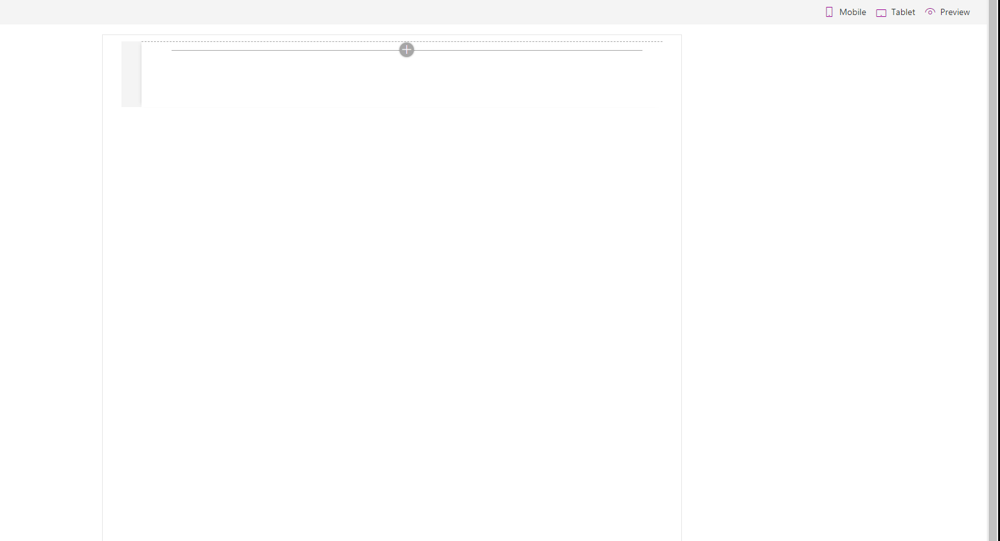

# ZipRecruiter Jobs Display Webpart

## Summary
This is a SharePoint webpart that allows you to display job openings from [ZipRecruiter](https://www.ziprecruiter.com/) on a site page. Any page on ZipRecruiter that displays the jobs in a list format will pull in results to this webpart. Just enter the job keywords and location combination or select the company you'd like and grab the URL of the page that displays the results. For example, if you were looking for the results of a specific company, the URL would be `https://www.ziprecruiter.com/c/[NAME-OF-COMPANY]/Jobs`.

This part features some customization as well. You can set the number of results to display and the rest (if any) will be accesssible through a link at the bottom of the webpart. Descriptions can be toggled on and off and you can enter a custom title.

Note that this webpart does not interact with ZipRecruiter directly due to CORS issues, so it's hitting a server which grabs the data on each call. That server and all it's files are available in [another repository](https://github.com/heythisispaul/zipserver) here on Github.

This program was written in React 15.6 and SPFx 1.4.1, so if you're happy with the current iteration, you can download the `zip-recruiter.sppkg` file in the `/sharepoint/solution/` folder.

## Used SharePoint Framework Version 

## Applies to

* [SharePoint Framework](https:/dev.office.com/sharepoint)
* [Office 365 tenant](https://dev.office.com/sharepoint/docs/spfx/set-up-your-development-environment)

## Solution

Solution|Author(s)
--------|---------
ZipRecruiter Job Postings|Paul Richard

## Version history

Version|Date|Comments
-------|----|--------
1.0|March 30, 2018|Initial release

## Disclaimer
**THIS CODE IS PROVIDED *AS IS* WITHOUT WARRANTY OF ANY KIND, EITHER EXPRESS OR IMPLIED, INCLUDING ANY IMPLIED WARRANTIES OF FITNESS FOR A PARTICULAR PURPOSE, MERCHANTABILITY, OR NON-INFRINGEMENT.**

---

## Minimal Path to Awesome

- Clone this repository
- in the command line run:
  - `npm install`
  - `gulp serve`

  ## Features
  
  - SPFx React framework
  - using Office UI Fabric React components for building a user experience